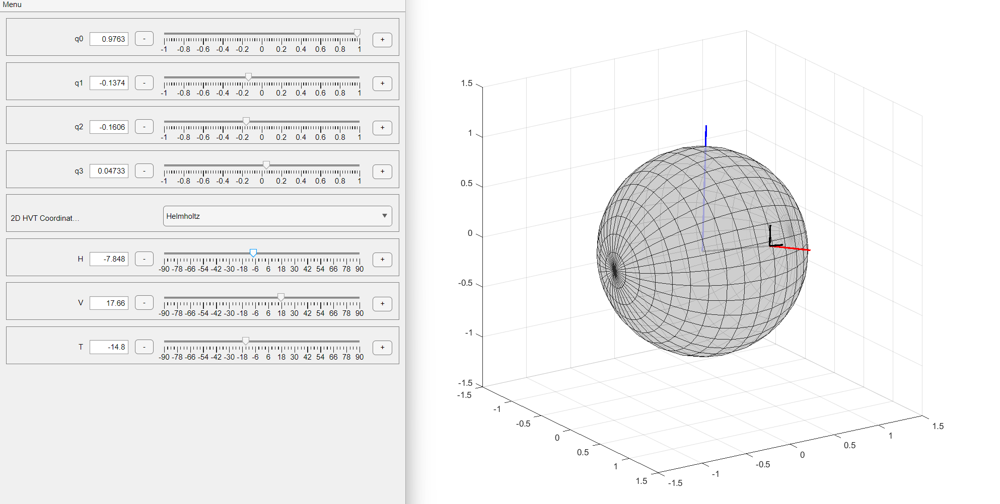

This will be a repository of a set of tools use in the lab. 

# Disparity simulator
The first one is a simulator of disparities in 3D.

To run, download or clone the respository and just run the matlab command from the repository folder 
```
>> Geometry3D.demoDisparity
```
Then this graphical interactive tool should open:


# Quaternion simulator
This is a tool to visualze a quaternion (sort of) and the equivalent eye position in either Helmholtz (first vertical then horizontal) or Fick (first horizontal then vertical)

To run, download or clone the respository and just run the matlab command from the repository folder 
```
>> Geometry3D.demoQuaternion
```

