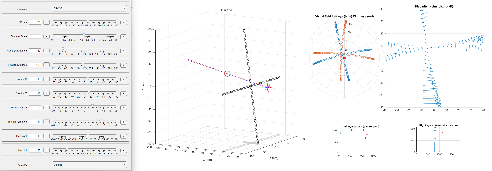

This will be a repository of a set of tools use in the lab. 

The first one is a simulator of disparities in 3D.

To run, download or clone the respository and just run the matlab command from the folder 
```
>> Geometry3D.demoDisparity
```
Then this graphical interactive tool should open:

